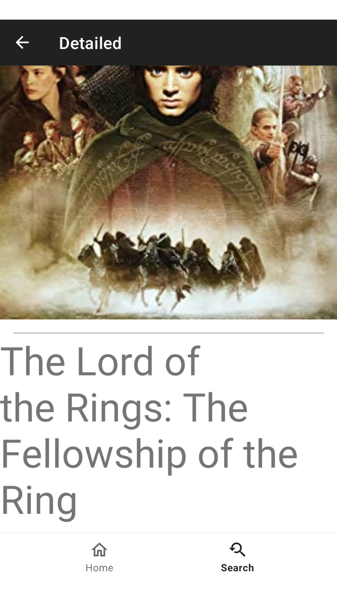
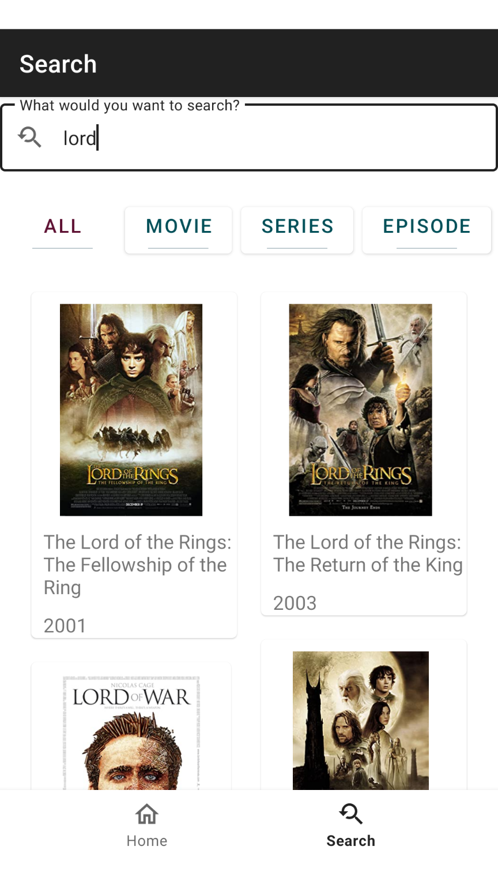
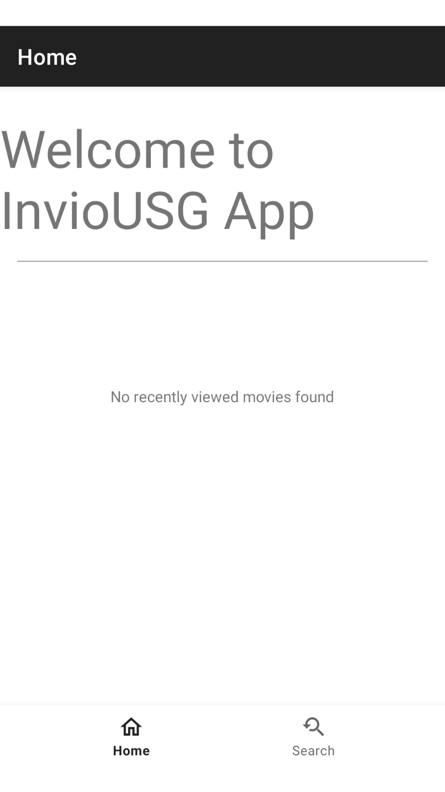

# Movie Search App
This Android app provides a platform to search and view information about movies, series and episodes. It uses OMDB API to fetch the movie data and Room database to store the recently viewed items.

## Features
Search page: Showcase movies based on categories such as movie, series and episodes with a search function.
Main page: Displays a welcome message and the recently viewed items stored in the Room database.
Detail screen: Showcases the title, IMDB rating, length, description, and genre information for each movie or episode selected.
Libraries and Technologies Used
* RxJava
* Retrofit
* Room database
* Navigation Components
* MVVM (Model-View-ViewModel)
* Clean Architecture
* DataBinding
* Glide
* Hilt
## Screenshots
Detail screen: 
Search screen: 
Main screen: 
## Getting Started
To use this app, clone or download the repository and import it into Android Studio. You'll need to obtain an API key from OMDB API and replace it in the com.ahk.inviousg.util.Constants file.

API_KEY="your_api_key"
Once you have the API key, you can build and run the app on your Android device or emulator.
